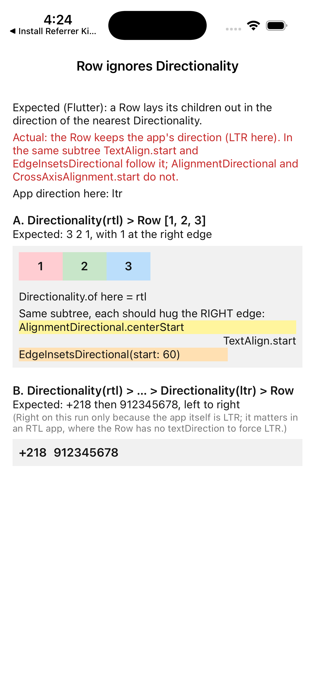

# Repro: a subtree `Directionality` doesn't change a `Row`'s order (and `Row`/`Flex` have no `textDirection`)

The DartNative 1.0.0 changelog says `Directionality` is supported and "Wrap a subtree in `Directionality` to set it by hand." Under `Directionality(textDirection: TextDirection.rtl)` a `Row` still lays out its children left to right, in the app's direction. In an Arabic-first app this is needed both ways: an RTL block on an LTR screen, and, more often, an LTR run inside an RTL screen (a phone number with its country code, an amount with its sign). `Row` and `Flex` also have no `textDirection` parameter to force it locally.

## Run

`dn run` (iOS simulator; Android behaves the same unless stated).

## What you'll see

The simulator is in English, so the app direction is LTR (shown on screen).

- **A.** `Directionality(rtl) > Row [1, 2, 3]` shows 1 2 3 from the left. `Directionality.of` inside reports `rtl`. In the same subtree, for comparison:
  - `TextAlign.start` text sits at the right edge (follows the subtree);
  - `EdgeInsetsDirectional(start: 60)` puts its 60 pt on the right (follows the subtree), but the box itself, placed by the `Column`'s `CrossAxisAlignment.start`, sits at the left;
  - `AlignmentDirectional.centerStart` in a full-width `Container` puts its text at the left.
- **B.** `Directionality(rtl) > … > Directionality(ltr) > Row [+218, 912345678]` reads `+218 912345678`. That is right on this run only because the app itself is LTR; in an RTL app (Arabic device language) this is the case that matters, and `Row` has no `textDirection` to force LTR.

## Expected

As in Flutter: a `Row`/`Flex` without its own `textDirection` uses `Directionality.of(context)`, so A reads 3 2 1 (1 at the right edge), and `AlignmentDirectional.centerStart` / `CrossAxisAlignment.start` resolve to the right in that subtree. `Row(textDirection: TextDirection.ltr)` keeps `+218 912345678` in order whatever the ambient direction.

## Recording

## Environment

- DartNative 1.0.0 (SDK `113c27aacb2`, framework edition `7ae29132`), Dart 3.12.0
- macOS 26.7.1, Xcode 26.1.1
- iPhone 17 simulator, iOS 26.1
